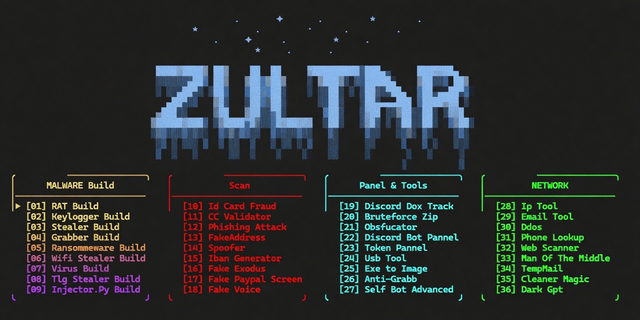

# ZULTAR

> A clean and easy-to-use **Discord Multi-Tool** with a modern GUI.

## ✨ Features

### 🆕 New Additions
- Webhook Nuker / Deletor
- Nitro Generator
- Discord Crasher

### Main Features
- Grabber Generator
- MWare Generator
- 🐭 Generator
- ...and more

## 🚀 How to Use

1. Go to the **[Releases](https://github.com/iamsuperdoopercoolmax/Zultar-Discord-Multi-Tool/releases)** page
2. Download the latest **`ToolsClient.exe`**
3. Double-click the file to launch it
4. The GUI will open and you can start using the tools

> **Note**: Windows may flag the file as unknown. Click **"More info" → "Run anyway"**.

## Screenshots

## Requirements
- Windows 10 / 11
- No installation needed

## Contributing
Feel free to fork, open issues, or submit pull requests to add new tools!

## License
MIT License
